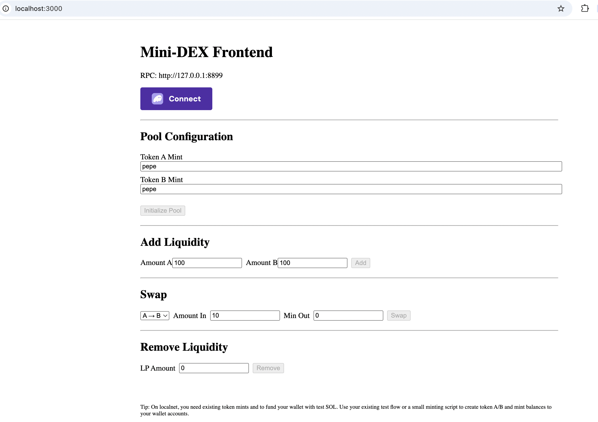

# Mini‑DEX Frontend Guide (Junior‑friendly)


Frontend architecture: wallet providers, IDL loading, and instruction flows.

This guide explains every piece of the frontend, the tools we use, and how to run it against your local Solana network. It mirrors the clarity of the backend docs and is tailored for junior blockchain developers.

## Requirements
- Node >= 20.18.0
- Yarn 1.x (classic)
- Do not mix lockfiles/package managers (remove any `package-lock.json` when using Yarn)
- Use IPv4 RPC (http://127.0.0.1:8899) and run validator with `COPYFILE_DISABLE=1` on macOS

## What you will build
A simple web UI that lets you:
- Connect a wallet (Phantom/Solflare)
- Initialize a new pool
- Add liquidity
- Swap A ↔ B
- Remove liquidity

The UI talks to the on-chain Anchor program using the program’s IDL and the same PDA seeds used in tests.

## Tech stack (tools and concepts)
- Next.js (React + TypeScript): UI framework
- @solana/wallet-adapter: wallet connectors and UI modal
- @coral-xyz/anchor: Anchor client to call program instructions from the browser
- @solana/web3.js: Solana primitives (PublicKey, Transaction, etc.)
- @solana/spl-token: Token helpers (ATAs creation, constants)

Concepts:
- IDL: JSON description of your Anchor program used by clients to encode instructions
- PDA (Program Derived Address): deterministic addresses derived from seeds (we use the same seeds as in tests)
- ATA (Associated Token Account): standard token account for a wallet x mint pair; created if missing

## Repository layout (frontend)
```
mini-dex/app
├─ package.json              # scripts & dependencies
├─ tsconfig.json             # TypeScript config
├─ next.config.js            # Next.js config
├─ .env.example              # copy to .env.local and adjust
├─ public/
│  └─ idl/
│     └─ mini_dex.json      # IDL file (copy from ../../target/idl/mini_dex.json)
└─ src/
   ├─ pages/
   │  ├─ _app.tsx           # Wallet providers & layout
   │  └─ index.tsx          # All four flows (init, add, swap, remove)
   └─ lib/
      ├─ anchor.ts          # Load IDL, get Program/Provider, RPC
      ├─ pdas.ts            # PDA derivations (same seeds as tests)
      └─ tokens.ts          # Helpers to ensure/create ATAs
```

## Important env vars
Create `mini-dex/app/.env.local` (copy from `.env.example`):
```
NEXT_PUBLIC_RPC_URL=http://127.0.0.1:8899
NEXT_PUBLIC_PROGRAM_ID=<YOUR_PROGRAM_ID>
```
- Use IPv4 `127.0.0.1` on macOS to avoid `::1` issues.
- Get `<YOUR_PROGRAM_ID>` from `anchor deploy` output or `Anchor.toml` under `[programs.localnet]`.
- Make sure the program id in `.env.local` matches your deployed program.

## One-time setup
1) Install dependencies for the frontend:
```
cd mini-dex/app
yarn install
```
2) Provide the IDL the frontend will load at runtime:
```
# From repo root
cp mini-dex/target/idl/mini_dex.json mini-dex/app/public/idl/mini_dex.json
```

## Local development workflow
Open three terminals.

Terminal A — start a clean local validator managed by Anchor (macOS-safe):
```
cd mini-dex
COPYFILE_DISABLE=1 anchor localnet
```
Notes:
- This avoids macOS AppleDouble files breaking genesis archives.
- Anchor will print the RPC: `http://127.0.0.1:8899`.

Terminal B — build & deploy the program:
```
cd mini-dex
solana config set --url http://127.0.0.1:8899
anchor build
anchor deploy
```
After a successful deploy, confirm your program id matches `.env.local`.

Terminal C — run the frontend:
```
cd mini-dex/app
# Ensure .env.local exists and IDL file is copied
yarn dev
```
Open http://localhost:3000 and connect Phantom (set to Localnet). Use an airdrop to fund the wallet.

## How the code maps to the on-chain program
Seeds (same as tests and program code):
- `pool = PDA(["pool", tokenAMint, tokenBMint])`
- `poolAuthority = PDA(["pool_authority", pool])`
- `tokenAVault = PDA(["token_a_vault", pool])`
- `tokenBVault = PDA(["token_b_vault", pool])`
- `lpTokenMint = PDA(["lp_token_mint", pool])`

Frontend derives these PDAs in `src/lib/pdas.ts` and passes them to Anchor methods just like tests do.

### Initialize pool
- File: `src/pages/index.tsx`, handler `onInit`
- Calls `program.methods.initializePool()` with accounts: `pool`, `poolAuthority`, `tokenAMint`, `tokenBMint`, `tokenAVault`, `tokenBVault`, `lpTokenMint`, `payer`, `systemProgram`, `tokenProgram`, `rent`.

### Add liquidity
- File: `src/pages/index.tsx`, handler `onAddLiquidity`
- Ensures ATAs for user: A, B, LP via `ensureAtas`
- Calls `addLiquidity(amountA, amountB, minLp)` with mapped accounts

### Swap
- File: `src/pages/index.tsx`, handler `onSwap`
- Ensures ATAs for user tokens
- Chooses direction via `is_a_to_b` boolean
- Calls `swap(amountIn, minOut, isAToB)` with mapped accounts

### Remove liquidity
- File: `src/pages/index.tsx`, handler `onRemove`
- Ensures ATAs for LP, A, B
- Calls `removeLiquidity(lpAmount, minA, minB)`

## Common pitfalls (and fixes)
- IPv6 localhost on macOS: always use `http://127.0.0.1:8899` (not `http://localhost:8899`).
- AppleDouble tar issue: run validator as `COPYFILE_DISABLE=1 anchor localnet`.
- Program id mismatch: update `.env.local` `NEXT_PUBLIC_PROGRAM_ID` after `anchor keys sync` or a new keypair.
- Missing IDL: copy from `mini-dex/target/idl/mini_dex.json` to `mini-dex/app/public/idl/mini_dex.json`.
- Missing ATAs: the UI will create ATAs when needed via `ensureAtas` helper.

## Extending the UI
- Add balances: read token account balances for user and pool vaults.
- Add pool list: persist known pools in local storage or a small JSON.
- Add slippage controls and preview: replicate on-chain math or simulate via `simulateTransaction`.
- Support devnet: provide a toggle and a different RPC URL/program id pair.

## Troubleshooting checklist
- `fetch failed` or `ECONNREFUSED ::1:8899`: set RPC to 127.0.0.1 and verify validator is running.
- `Program's authority ... does not match`: reset `.anchor/test-ledger` or generate/sync a new program id.
- `IDL not found`: ensure the `public/idl/mini_dex.json` file exists and is valid JSON.

## Summary
You now have a junior-friendly frontend that mirrors the backend flows:
- Deterministic PDAs for all accounts
- One-page UI to call all four instructions
- Clear local setup steps that match the backend docs

Happy hacking! 🚀
